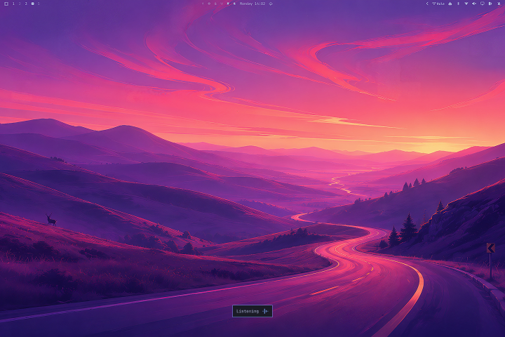
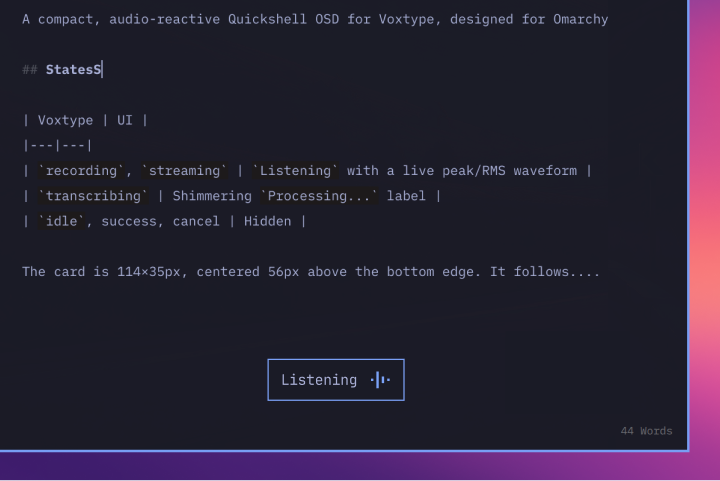

# voxtype-osd-omarchy

A compact, audio-reactive Quickshell OSD for Voxtype, designed for Omarchy.

## Preview

### Listening



### Processing


### Detail



## States

| Voxtype | UI |
|---|---|
| `recording`, `streaming` | `Listening` with a live peak/RMS waveform |
| `transcribing` | Shimmering `Processing...` label |
| `idle`, success, cancel | Hidden |

The card is 114×35px, centered 56px above the bottom edge. It follows the active Omarchy notification theme. If theme colors are unavailable, it falls back to the original Tokyo Night colors `#1A1B26`, `#7AA2F7`, and `#A9AFD5`. Typography uses JetBrainsMono Nerd Font.

## Theme integration

| OSD element | Omarchy color |
|---|---|
| Card | `notifications.background` |
| Border | `notifications.border` |
| Audio bars | `notifications.countdown` |
| Listening and Processing text | `notifications.text` |

The OSD reloads the active theme's `colors.toml` and `shell.toml`, so color changes apply without restarting Voxtype even when Omarchy replaces the theme directory.

## Requirements

- Voxtype 1.0.1 or newer
- Quickshell
- `voxtype-audio-bridge`
- JetBrainsMono Nerd Font
- A systemd user service named `voxtype.service`

## Install

### Arch Linux / Omarchy

An AUR package has been prepared, but new AUR account registration is currently closed and the package has not been published. Until it becomes available, use the GitHub installation below.

Once the AUR package is published, installation will be:

```bash
yay -S voxtype-osd-omarchy
voxtype-osd-omarchy enable
```

Check or disable it with:

```bash
voxtype-osd-omarchy status
voxtype-osd-omarchy disable
```

Run `voxtype-osd-omarchy disable` before removing the future AUR package so your previous Voxtype OSD settings can be restored.

### GitHub

Review the repository, then run:

```bash
git clone https://github.com/temurlee/voxtype-osd-omarchy.git
cd voxtype-osd-omarchy
./install.sh
```

The installer copies the package into `~/.config/voxtype/osd/voxtype-osd-omarchy`, saves the previous OSD settings, switches Voxtype to its Quickshell frontend, and verifies the resolved custom QML path. Run it again to update an existing installation.

It does not change the transcription model, language, output mode, or keyboard shortcut.

## Uninstall

```bash
~/.config/voxtype/osd/voxtype-osd-omarchy/uninstall.sh
```

Uninstall restores only the three OSD fields changed during installation: `frontend`, `layout`, and `plugin_path`.

## Development

After editing QML or the manifest, restart Voxtype:

```bash
systemctl --user restart voxtype.service
```

The active style resolution is available at `$XDG_RUNTIME_DIR/voxtype/quickshell-style.json`.

## Current limitation

The layout has been verified on one 1440×960 logical display. Multi-monitor placement still needs real-device validation.
